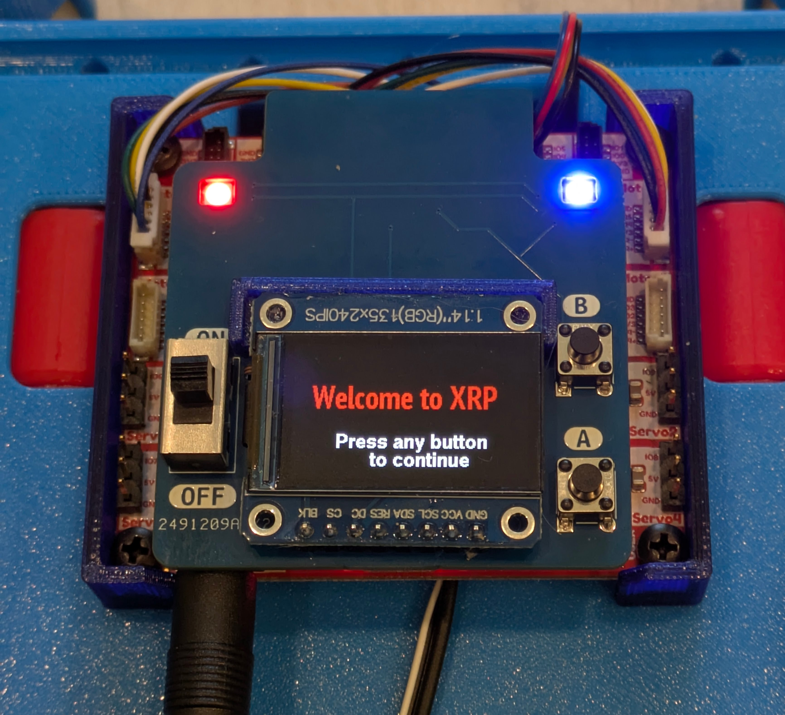
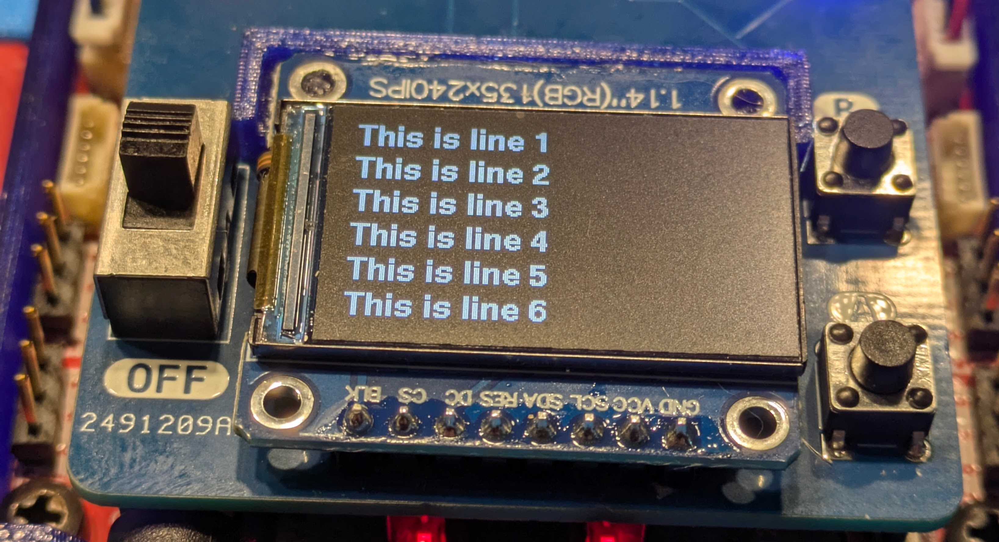

Display, buttons, LEDs
======================

XRP display contains two NeoPixel  LEDs in the front, an 135x240 OLED screen and
two buttons for interaction with the user. To control them,
use the functions below. All functions below are methods of the `display` object, 
so they should be called as `display.set_leds(...)`, `display.set_text(...)`, etc.

LEDs
-----
.. function:: set_leds(color_l, color_r)

   Set colors of both LEDs at the same time; first argument is the color for the left LED, 
   second argument is the color for the right LED. Parameter ``color_r`` is optional; if omitted, both LEDs will
   be set to the same color. Each color
   must be a triple  of numbers, showing the values of Red, Green, and Blue
   colors, each ranging between 0--255, e.g. ``display.set_leds((255,0,0))`` to set
   the LEDs red.  You can also define named colors for easier use, e.g.

.. code-block:: python

    BLUE=(0,0,255)
    display.set_leds(BLUE)

Note that the LEDs are quite bright, so it is recommended to use relatively low values for 
the colors, e.g. 64 instead of 255, to avoid hurting your eyes and draining the batteries unnecessarily fast.

Buttons
-------

.. function:: wait_for_button()

   Waits until the user presses a button; returns the value indicating which button was pressed. 
   There are two possible values: ``display.buttonA`` and ``display.buttonB`` (in fact, these values 
   are just 1 and 2, but it is better to use the named constants for better readability of the code).

.. function:: is_button_pressed(button)

   Returns ``True`` if given button is currently pressed and ``False`` otherwise.

OLED display: basic operations
-------------------------------

The easiest way to interact with OLED display is by using the commands below.

.. function:: clear()

   Clears display, filling it with black pixels. 

.. function:: write_line(i, text, font = None, fg = None)

   Writes text on i-th line of display (i ranges 1--6). The text can be split into several lines using `\\n` escape sequence. 
   For example, `write_line(2, 'press button \\n to continue')` will write `press button` on line 2 and `to continue` on line 3. 
   This function automatically cleares these lines before writing new text. 

   Arguments `font` and `fg` (foreground color) are optional; if omitted, it will use default font (`display.smallfont`, 
   which is Helvetica bold) and white color. Other possible fonts are `display.smallfont2` (PT Sans Narrow_24), similar in size to the default 
   font but slightly more narrow, and `display.largefont` (PT Sans Narrow_32), a larger font. Note that `display.largefont` is taller than line 
   height, so using e.g. `display.write_line(2, "some text", font = display.largefont)` will actually get into the space reserved for line 3 as well as 2. 
   You might need to manually clear line 3 (by using `display.write_line(3,'')`) if it was non-empty. 

   Argument `fg` should be a color in RGB565 encoding; note that this is different 
   from the triple of values used for Neopixel colors -- these are not interchangeable. The library contains several predefined colors: 
   BLACK, DARKGREY, NAVY, BLUE, GREEN, TEAL, AZURE, LIME, CYAN, MAROON, PURPLE, OLIVE, GREY, SILVER, RED, ROSE, MAGENTA, ORANGE,
   YELLOW, WHITE
   (all are properties of display object, e.g. `display.BLACK`).

Display: advanced 
------------------

When the above functions are not enough, you can use all graphics methods of micropython `framebuffer` class with `display` object, for example 
`display.rect(0,0,40,40, display.RED)`. Full list of supported framebuffer methods can be found at https://docs.micropython.org/en/latest/library/framebuf.html. 
Note that you will need to call `display.show()` to make the display show graphics constructed in this way (unlike `write_line` command that doesn't 
require that).

You can also place text in any position on screen, using `write()` method with any of the fonts (`display.smallfont`, `display.smallfont2`, `display.largefont`), 
e.g. 

.. code-block:: python

   display.largefont.write(20, 30, "Welcome!", fg = display.YELLOW)
   display.show()

Full documentation of `write()` method can be found at 
https://github.com/easytarget/microPyEZfonts/blob/main/WRITER.md .
As before, you will need to call `display.show()` to make these texts appear on screen. 

