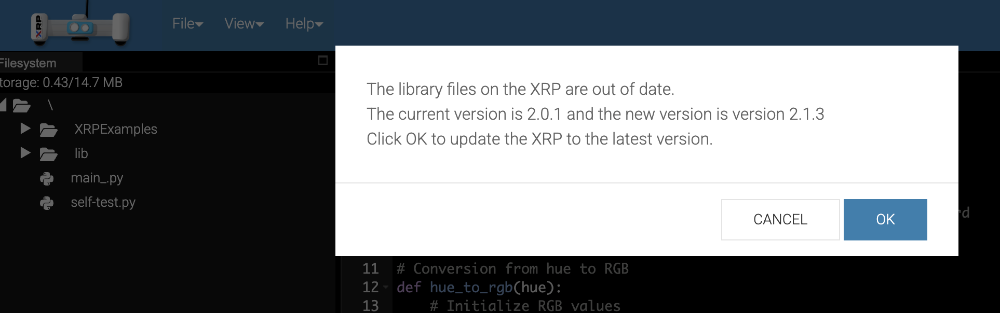
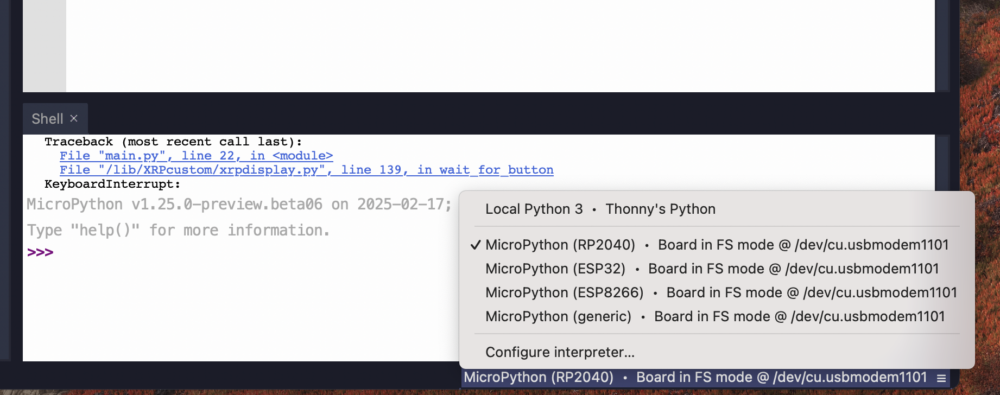
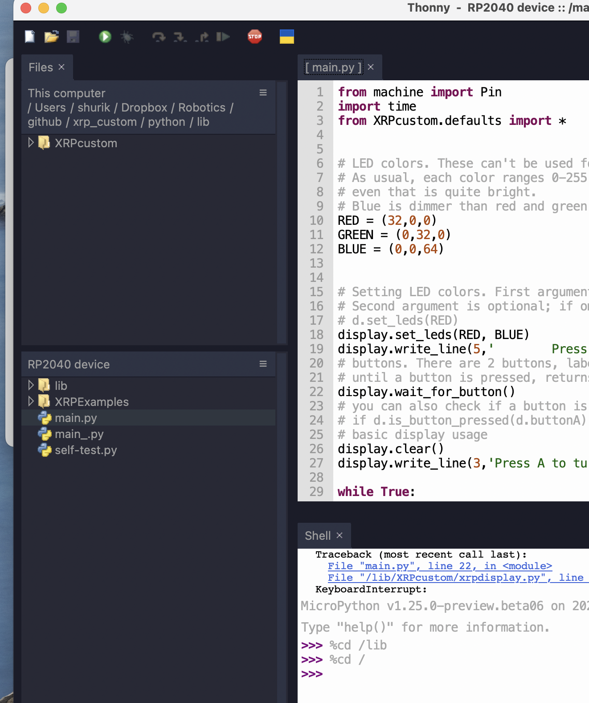

Micropython library  installation
====================================
XRP  is intended to be programmed in MicroPython  - an implementation of
Python programming language for microcontrollers. For general background on
MicroPython, please visit `MicroPython website <https://micropython.org/>`__
.

Default library update
-----------------------

The XRP should come to you with MicroPython firmware and XRP library already installed. 
To verify it and update the library, connect the robot to your computer, open browser 
(Chrome) and navigate to https://xrpcode.wpi.edu/ 
It should automatically detect the robot and check the library version; if the library needs to be updated, 
it will prompt you to do so, as shown in the figure below; hit "OK" to update the library. Otherise, you are ready to go. 
Please  close the web-based interface to continue. 

Thonny editor installation
--------------------------
For many reasons, I suggest NOT using the above web-based interface to edit and run your code. 
Instead, I suggest using Thonny editor, which is a free and open-source Python IDE. You can download it for 
free from https://thonny.org/ and install it on your computer (Linux, Mac or Windows).

After downloading and installing Thonny editor,
start Thonny and connect the robot to your computer using a 
USB cable. 

Select `MicroPython (RP2040)` in the lower right corner
of the screen. (XRP actually uses newer RP2350 board, not RP2040, so 
Thonny message is slightly misleading, but it is not a problem). 
Tab `Shell` should show  version of MicroPython installed on the XRP board, 
similar to what is shown below. 

Make sure to enable "Files" pane of Thonny; it should show the file system of both your computer and the robot. 
If it is not shown, enable it in "View" menu.

Custom library installation
----------------------------
1. Go to |github|, click green  "Code" button and select "Download ZIP" to download the repository to your computer. 
   Unzip the downloaded file.
   
  .. figure:: ../images/quickstart-github.png
      :alt: GitHub repository
      :width: 80%

2. Start Thonny editor, connect the robot to your computer. Make sure you have selected `MicroPython (RP2040)` 
  in the lower right corner of the screen and that you can see the file system of the robot in "Files" pane.

3. Find file `main.py` in the file system of your robot. This file is executed when the robot starts. The default 
  file coming with the robot uses some complicated logic  to determine which program to run; we will not be using it. 
  Rename this file to `main_old.py` to keep it as a backup. 
  
4. Change to   folder `/lib/` on the robot by clicking on it in the `File` pane. 
   It should contain subfolders `XRPLib`, `ble` and possibly others. 

5. Use Thonny to navigate to the downloaded repository; find folder `python/lib/`. It should contain subfolder `XRPcustom`. Right-click on this folder and select "Upload to /lib"; make sure it is uploading to `/lib`  folder and not to the top level directory. 
  
  .. figure:: ../images/quickstart-upload.png
      :alt: Upload library
      :width: 80%

That's it! You are ready to start programming your robot. 
